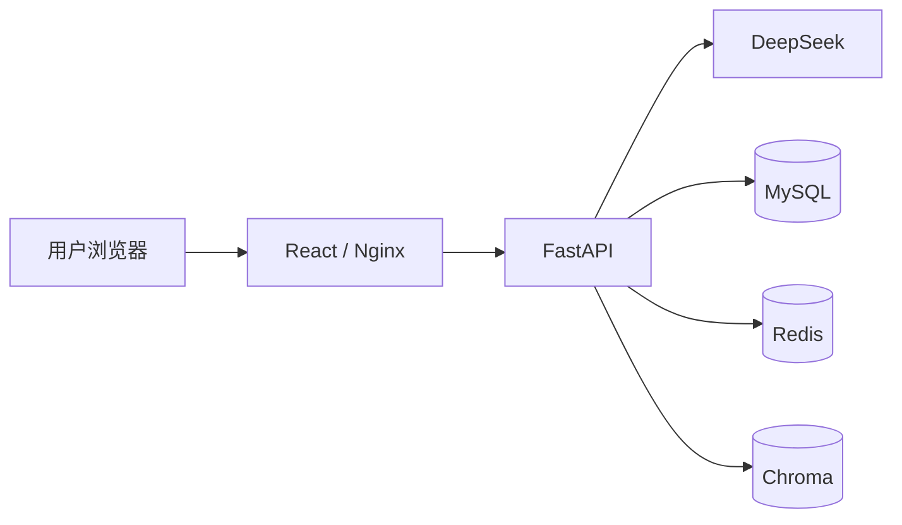

# AI 求职助手（AI Job Assistant）

面向求职场景的一站式 AI 工作台，提供简历解析、岗位匹配、智能对话与个人 RAG 知识库能力。

| 项目状态 | 结果 |
| --- | --- |
| 当前版本 | **v0.1.0 · 已正式发布** |
| 自动化测试 | **31 passed** |
| Docker 全栈 | **已就绪**：React/Nginx、FastAPI、MySQL、Redis，Chroma 与业务数据支持持久化 |

## 核心功能

- 用户注册登录与 JWT 身份认证
- PDF 简历上传、文本解析与记录保存
- 简历与岗位 JD 智能匹配分析
- 基于 DeepSeek 的 AI 求职对话
- 基于 LangChain + Chroma 的个人 RAG 知识库
- 简历、分析、普通对话与 RAG 问答历史
- API、关系数据与向量检索的用户级数据隔离
- Docker Compose 全栈编排与数据卷持久化

## 技术栈

- **前端：** React + TypeScript（Vite）
- **后端：** FastAPI（Python 3.12）
- **AI 编排：** LangChain
- **大语言模型：** DeepSeek
- **向量数据库：** Chroma
- **关系数据库：** MySQL
- **缓存基础设施：** Redis
- **身份认证：** JWT
- **容器编排：** Docker Compose
- **Web 服务与反向代理：** Nginx

## 项目架构



浏览器通过 Nginx 访问 React 单页应用，并将 `/api` 请求反向代理到 FastAPI。FastAPI 负责认证、业务编排与数据隔离，调用 DeepSeek 完成生成任务，通过 MySQL 保存业务记录，通过 Chroma 保存和检索知识向量；Redis 已纳入 Compose 与连接层，作为缓存基础设施预留。

详细设计见 [docs/architecture.md](docs/architecture.md)。

## 功能说明

### 用户注册登录

用户可使用用户名、邮箱和密码注册，通过登录接口获取 JWT。受保护的接口从 Bearer Token 识别当前用户，密码仅以 bcrypt 哈希形式保存。

### PDF 简历解析

支持上传不超过 10 MB 的文本型 PDF 简历，解析文件名、页数和正文。登录用户的解析结果会保存到 MySQL，供后续分析与历史查看使用。

### 简历与 JD 匹配

将简历正文与岗位描述提交给 AI，返回 0–100 匹配分、匹配技能、缺失技能、简历优化建议和可能的面试问题。登录用户可将结果关联到自己的简历记录。

### AI 对话

通过 LangChain 调用 DeepSeek，提供通用求职问答。登录状态下的对话会保存到个人历史记录。

### RAG 知识库

登录用户可上传招聘 JD、面试资料等 PDF。系统解析并切分文本，生成向量后写入持久化 Chroma；提问时只检索当前用户的文档，并返回答案及来源文件。

本地 Docker Compose 默认设置 `RAG_ENABLED=true`，保留完整的模型下载、Chroma
持久化和知识库功能。CloudBase 求职展示预览版设置 `RAG_ENABLED=false`，暂时关闭
知识库上传、预热和 RAG 问答，注册登录、简历解析、JD 匹配、普通 AI 对话及历史记录
不受影响。后续版本将迁移到独立向量数据库服务后再开放云端 RAG。

### 历史记录

工作台按分类展示当前用户的简历、匹配分析、普通 AI 对话和 RAG 问答，列表接口支持分页，分析记录支持查看详情。

### 用户数据隔离

MySQL 查询通过 `user_id` 限定数据所有权，知识库向量以用户元数据过滤。用户不能读取、关联或删除其他用户的简历、分析记录、对话和知识文档。

### Docker 持久化

Compose 使用命名卷保存 MySQL、Redis、Chroma 和 Hugging Face 模型缓存。重建应用容器不会清空这些数据；如需删除数据卷，必须显式执行带 `--volumes` 的停机操作。

## 项目截图

截图目录已预留为 [`docs/images/`](docs/images/)。添加截图后可启用以下位置：

<!--  -->
<!--  -->
<!--  -->

## Docker 快速启动

### 1. 准备配置

```bash
cp .env.example .env
```

Windows PowerShell：

```powershell
Copy-Item .env.example .env
```

在 `.env` 中替换所有占位符，至少设置数据库密码、JWT 签名密钥和 DeepSeek API Key。不要提交 `.env`。

### 2. 启动全栈

```bash
docker compose up -d --build
```

首次启动或数据库版本变化后执行迁移：

```bash
docker compose run --rm api alembic upgrade head
```

启动后可访问：

- Web 工作台：<http://localhost:3000>
- FastAPI：<http://localhost:8000>
- API 文档（非生产环境）：<http://localhost:8000/docs>

查看服务状态：

```bash
docker compose ps
```

完整演示流程见 [docs/demo-guide.md](docs/demo-guide.md)。

## 环境变量

仓库提供 `.env.example`。以下示例仅使用占位符，必须按实际部署环境替换：

```dotenv
APP_ENV=<development-or-production>
APP_DEBUG=<true-or-false>
APP_PORT=<api-port>
WEB_PORT=<web-port>

MYSQL_DATABASE=<database-name>
MYSQL_USER=<database-user>
MYSQL_PASSWORD=<database-password>
MYSQL_ROOT_PASSWORD=<database-root-password>
DATABASE_URL=mysql+asyncmy://<database-user>:<database-password>@mysql:3306/<database-name>?charset=utf8mb4

REDIS_URL=redis://redis:6379/0

JWT_SECRET_KEY=<long-random-jwt-signing-secret>
JWT_ALGORITHM=<jwt-algorithm>
JWT_EXPIRE_MINUTES=<token-expiration-minutes>

DEEPSEEK_API_KEY=<your-deepseek-api-key>
DEEPSEEK_MODEL=<deepseek-model-name>

RAG_ENABLED=<true-or-false>
CHROMA_PERSIST_DIRECTORY=<chroma-data-directory>
CHROMA_COLLECTION_NAME=<chroma-collection-name>
EMBEDDING_MODEL=<embedding-model-name>
RAG_CHUNK_SIZE=<chunk-size>
RAG_CHUNK_OVERLAP=<chunk-overlap>
RAG_TOP_K=<retrieval-count>
```

安全要求：

- 禁止提交 `.env`、API Key、JWT 签名密钥、数据库密码或访问令牌。
- 每个环境应使用独立且足够长的随机 `JWT_SECRET_KEY`。
- 生产环境应关闭调试模式，并通过外部密钥管理方案注入敏感变量。

## 本地开发

后端：

```powershell
python -m venv .venv
.venv\Scripts\Activate.ps1
pip install -r requirements-dev.txt
docker compose up -d mysql redis
alembic upgrade head
uvicorn app.main:app --reload
```

前端：

```bash
cd frontend
npm install
npm run dev
```

Vite 开发服务器默认为 <http://localhost:5173>，并将 `/api` 请求代理到本地 FastAPI。

## 项目结构

```text
app/                         FastAPI 应用、业务服务、模型与 RAG
frontend/                    React + TypeScript 前端与 Nginx 配置
migrations/                  Alembic 数据库迁移
tests/                       pytest 自动化测试
docs/                        架构、演示与面试说明
docker-compose.yml           全栈服务与持久卷编排
```

## 质量检查

v0.1.0 自动化测试结果：`31 passed`。

```bash
pytest -q
ruff check .
python -m compileall -q app tests migrations
cd frontend && npm run build
```

## 项目文档

- [架构说明](docs/architecture.md)
- [CloudBase 预览版部署配置](docs/deploy-cloudbase.md)
- [演示指南](docs/demo-guide.md)
- [面试讲解笔记](docs/interview-notes.md)

## 版本说明

`v0.1.0` 是首个正式发布版本，已完成核心求职工作流、用户数据隔离、自动化测试与 Docker 全栈部署。本版本聚焦项目展示和稳定运行，不包含后续业务功能扩展。
