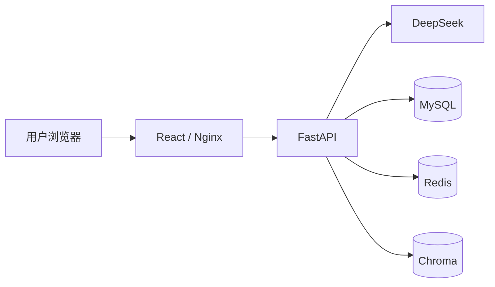
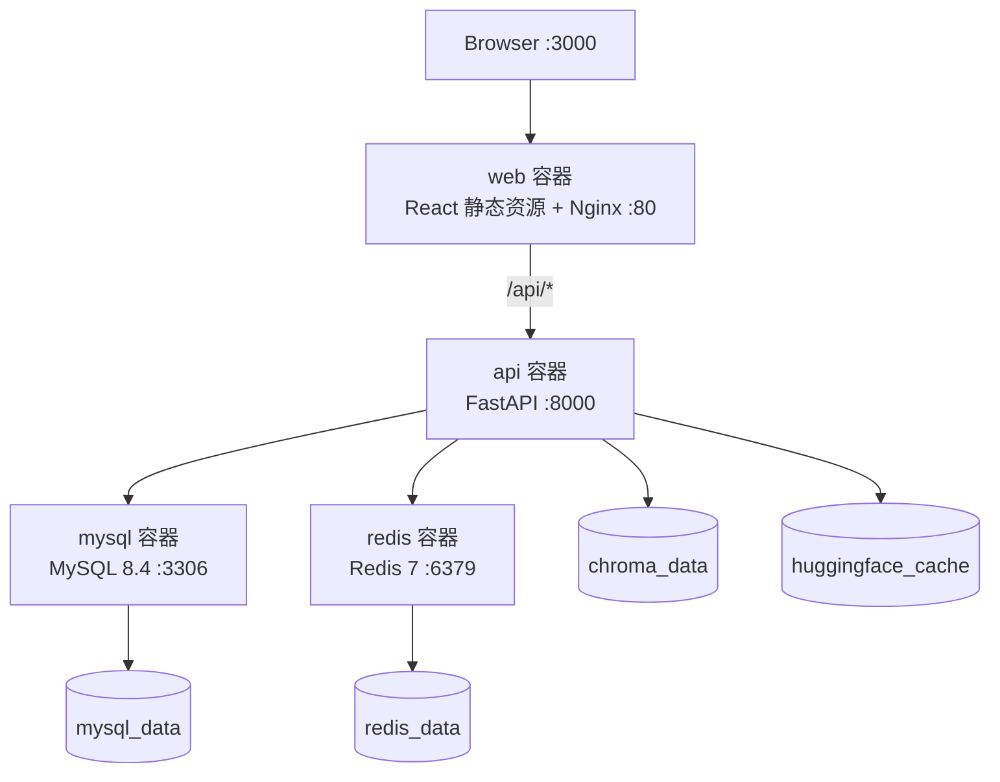
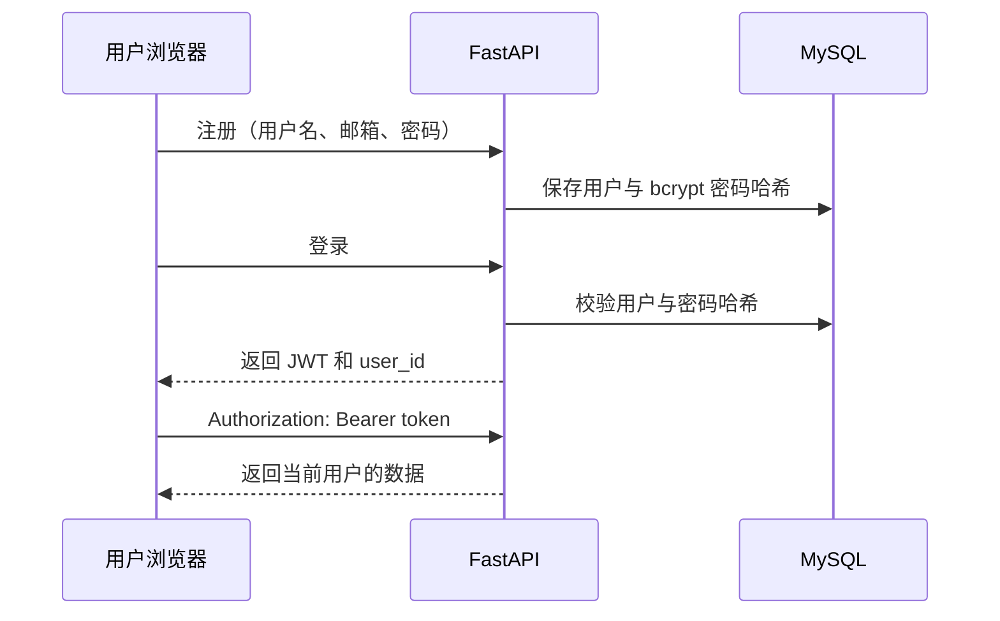
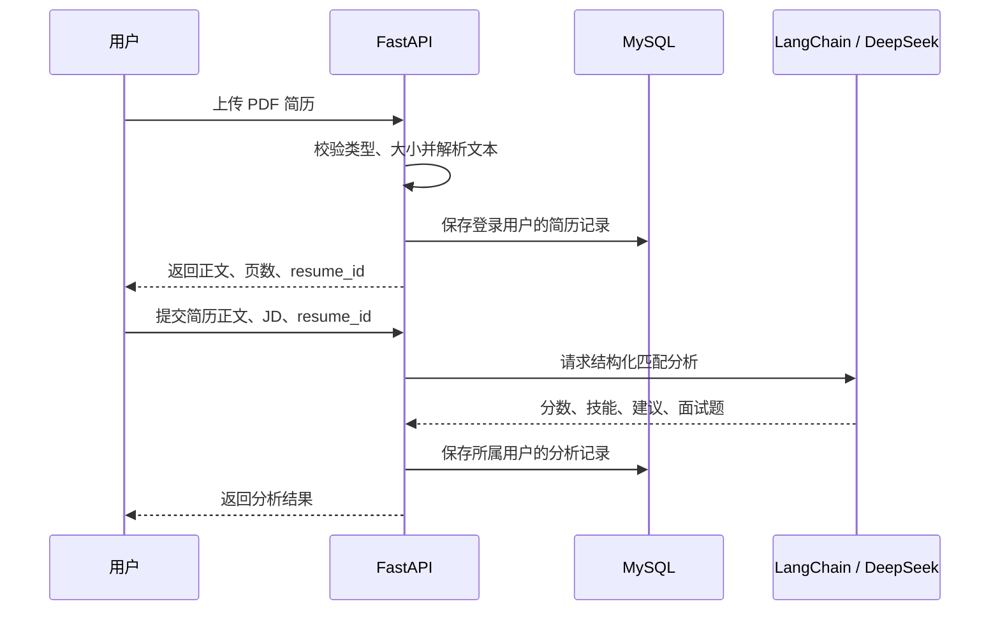
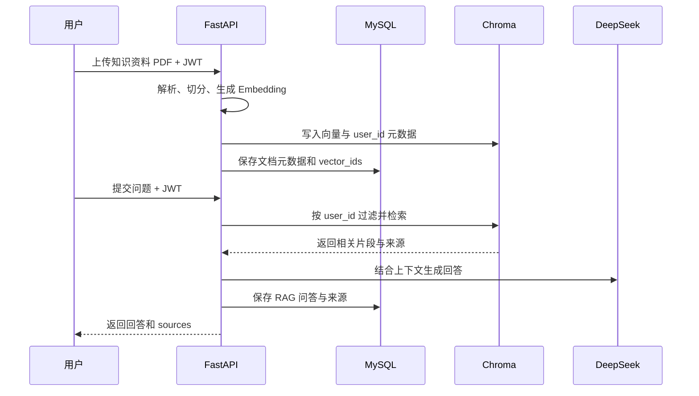

# AI 求职助手架构说明

## 1. 架构目标

v0.1.0 采用前后端分离和容器化部署，目标是将认证、AI 调用、关系数据、向量数据与 Web 入口分层，保证核心求职流程可演示、可测试、可持久化，并按用户隔离数据。

## 2. 系统上下文

- **React / TypeScript：** 提供注册登录、简历分析、AI 对话、知识库和历史记录工作台。
- **Nginx：** 托管前端静态文件，将 `/api/` 请求反向代理到 API 容器，并为 SPA 路由提供回退。
- **FastAPI：** 提供 REST API，完成参数校验、JWT 认证、业务编排、数据权限检查和异常处理。
- **LangChain / DeepSeek：** LangChain 统一模型调用，DeepSeek 完成求职对话和简历匹配分析。
- **MySQL：** 保存用户、简历、匹配分析、对话历史和知识文档元数据。
- **Chroma：** 持久化知识文档向量，并通过 `user_id` 元数据限定检索范围。
- **Redis：** 已提供异步客户端和 Compose 服务，作为缓存基础设施；v0.1.0 核心业务不依赖 Redis 缓存命中。

## 3. 容器拓扑

Compose 内部服务通过 `backend` 网络按服务名互访。MySQL 仅绑定宿主机回环地址的 `3307` 端口；Web、API 和 Redis 的宿主机端口可通过环境变量配置。

## 4. 核心数据流

### 4.1 注册与登录

JWT 用于识别请求用户，服务端查询会再次限定资源所有权。前端启动时通过 `/api/v1/auth/me` 校验本地会话。

### 4.2 简历解析与 JD 匹配

未登录用户可以进行不落库的简历解析和匹配；带 `resume_id` 保存分析时必须登录，且只能关联当前用户的简历。

### 4.3 RAG 知识库

删除知识文档时，系统先按当前用户查找文档，再删除登记的 Chroma 向量和 MySQL 元数据。

## 5. 数据模型

| 数据表 | 用途 | 隔离方式 |
| --- | --- | --- |
| `users` | 用户账号与密码哈希 | 用户 ID 主键 |
| `resumes` | PDF 文件名和解析正文 | `user_id` 外键 |
| `analysis_records` | 结构化匹配结果与 JD | 经 `resume_id` 关联所属用户 |
| `chat_histories` | 普通对话、RAG 问答和来源 | `user_id` + `chat_type` |
| `knowledge_documents` | 文档、分块数、向量 ID 等元数据 | `user_id` 外键 |

用户删除时，关联外键使用 `ON DELETE CASCADE` 清理业务记录。数据库结构由 Alembic 迁移管理。

## 6. 持久化设计

| Docker volume | 持久化内容 |
| --- | --- |
| `mysql_data` | 用户与业务记录 |
| `redis_data` | Redis 数据 |
| `chroma_data` | 知识库向量 |
| `huggingface_cache` | Embedding 模型缓存 |

容器重建不会删除命名卷。`docker compose down --volumes` 会删除持久化数据，不应在需要保留演示数据时执行。

API 容器启动命令会先运行 `python -m app.db.startup`。该模块等待数据库可连接，在 MySQL
上获取迁移锁并执行 `alembic upgrade head`，成功后才启动 Uvicorn。手动迁移命令只用于
自动迁移失败或需要独立排查的场景。

## 7. 安全边界

- 密码经 bcrypt 哈希，不保存明文密码。
- JWT 签名密钥只通过环境变量注入，仓库仅保留占位符。
- PDF 上传校验扩展名、MIME 类型和 10 MB 大小限制。
- 受保护 API 从 JWT 获取当前用户，数据库查询和向量检索均限定用户范围。
- Nginx 只代理 `/api/`，生产环境由部署层配置 HTTPS 和密钥管理。
- `.env`、本地数据目录、模型缓存和构建产物均由 `.gitignore` 排除。

## 8. v0.1.0 边界

当前版本聚焦求职助手的演示闭环。CloudBase 在线预览版关闭 RAG；本地 Docker 完整版才
加载本地 Embedding 模型并使用 Chroma。Redis 已完成配置与容器接入，但暂未承担关键业务
缓存。扫描版 PDF OCR、异步任务队列、多模型路由和运营后台不在 v0.1.0 范围内。

当前 AI 能力由 LangChain Prompt、DeepSeek 调用、结构化解析与 RAG 组成，没有实现工具
调用、自动规划、循环决策或 LangGraph Agent 工作流，因此不应描述为完整 AI Agent。

所有现有资源查询均按当前用户隔离；分析详情和知识文档删除会校验资源所有权。简历、
分析记录和聊天记录的删除接口暂未开放。
