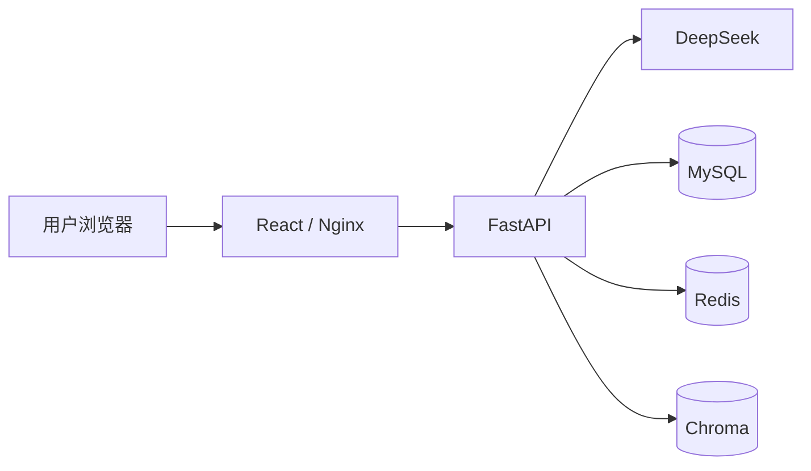

# AI 求职助手面试讲解笔记

## 1. 30 秒项目介绍

AI 求职助手是一个基于 React、FastAPI、DeepSeek、LangChain 和 RAG 的全栈求职工作台。
用户可以上传文本型 PDF 简历，与岗位 JD 做结构化匹配，也可以进行普通 AI 对话。本地
Docker 完整版还提供个人 RAG 知识库；CloudBase 在线预览版关闭 RAG。系统通过 JWT
认证、MySQL 业务数据过滤和 Chroma 元数据过滤实现用户隔离，并使用 Docker Compose
编排 Web、API、MySQL、Redis 及持久化卷。当前代码以 `v0.1.0 MVP` 描述，最新测试结果
以 `pytest` 或 CI 为准。

## 2. 项目解决的问题

传统求职准备通常分散在简历文件、岗位网页、聊天工具和个人笔记中。本项目把四类动作串成闭环：

1. 从 PDF 简历提取可分析文本。
2. 对比目标 JD，输出结构化差距和改进建议。
3. 通过通用 AI 对话补充求职规划与面试准备。
4. 在本地 Docker 完整版中，将岗位资料放入 RAG 知识库，得到带来源的回答。

历史记录让分析结果可回看，登录体系和数据隔离让不同用户可以安全使用同一套服务。

## 3. 技术架构怎么讲

推荐按请求链路讲解：

- 浏览器加载 React 单页应用，Nginx 同时负责静态资源与 `/api` 反向代理。
- FastAPI 完成请求校验、JWT 认证、业务编排和数据权限检查。
- LangChain 封装 DeepSeek 调用，使对话与结构化分析共享统一模型边界。
- MySQL 保存强结构、可关联的业务记录；Chroma 保存用于语义检索的向量。
- Redis 已作为 Compose 基础设施和异步连接层接入，但 v0.1.0 核心流程不依赖缓存，不能表述为“已经实现高命中缓存”。

## 4. 核心技术亮点

### 4.1 结构化简历匹配

模型输出被约束为固定响应结构：匹配分、匹配技能、缺失技能、简历建议和面试问题。相比返回一大段自由文本，这种设计更适合前端展示、数据库存储、自动化测试和后续扩展。

### 4.2 RAG 与来源追踪

知识资料经过 PDF 解析、文本切分和 Embedding 后写入 Chroma。提问时先检索与问题相关的片段，再把上下文交给 DeepSeek，最后返回去重后的来源文件。MySQL 额外保存文档元数据和向量 ID，便于列表展示与一致性删除。

### 4.3 双层用户隔离

- 关系数据层：从 JWT 获取当前用户，查询通过 `user_id` 或所属简历关系限定。
- 向量数据层：写入 Chroma 时携带 `user_id`，检索时使用同一字段过滤。

这避免了只在前端隐藏数据或只依赖客户端传参造成的越权风险。

### 4.4 容器与数据生命周期分离

React/Nginx 与 FastAPI 是可重建的无状态应用容器；MySQL、Redis、Chroma 和模型缓存使用命名卷。这样既能快速重新构建应用，也能保留演示数据和模型文件。

### 4.5 可测试性

外部模型和向量依赖通过服务边界替换为测试实现，自动化测试覆盖健康检查、认证持久化、
PDF 解析、简历分析、对话、RAG、历史记录、数据库启动和迁移。通过数量不写成长期承诺，
应以当前 `pytest` 或 CI 结果为准。

### 4.6 两种运行版本

- CloudBase 在线预览版：支持注册登录、文本型 PDF 简历解析、JD 匹配、普通 AI 对话、
  历史记录和 MySQL 持久化；关闭知识库上传、Embedding 预热、Chroma 检索和 RAG 问答。
- 本地 Docker 完整版：在上述功能之外，提供本地 Embedding、LangChain + Chroma RAG、
  知识库上传、来源引用以及 Chroma/Hugging Face 缓存持久化。
- 根目录 `Dockerfile` 只构建 FastAPI 后端；React 前端和后端的实际线上部署方式需根据
  CloudBase 服务配置确认。

## 5. 关键设计取舍

### 为什么使用 FastAPI？

FastAPI 提供类型提示驱动的参数校验、依赖注入、异步接口和 OpenAPI 文档，适合把认证、数据库会话和 AI 服务作为可替换依赖组织起来。

### 为什么 MySQL 和 Chroma 同时使用？

两者解决的问题不同。用户、简历和历史记录需要事务、约束与关联查询，适合 MySQL；知识片段需要向量相似度检索，适合 Chroma。MySQL 保存向量 ID 和文档元数据，把业务生命周期与向量生命周期关联起来。

### 为什么选择 JWT？

前后端分离场景下，JWT 便于通过 Bearer Token 携带认证信息。项目不会把用户 ID 当作可信身份，而是从签名令牌解析当前用户，再校验资源所有权。

### 为什么保留 Redis？

Redis 已进入部署拓扑和连接封装，为后续限流、短期会话、任务状态或热点结果缓存提供边界。v0.1.0 不把尚未落地的缓存策略包装成现有功能，这是架构预留而不是完成的业务能力。

### 为什么 RAG 需要预热？

本地多语言 Embedding 模型首次运行需要下载和加载。通过受保护的预热接口提前初始化，并将模型文件放在持久卷，可降低正式演示中第一次上传或问答的等待时间。

## 6. 安全与可靠性

- 密码使用 bcrypt 哈希，JWT 密钥和 DeepSeek Key 通过环境变量注入。
- `.env`、本地数据库、向量目录和模型缓存不进入 Git。
- PDF 上传校验文件类型和大小，文件名进行基础规范化。
- 所有现有资源查询均按当前用户隔离；分析详情和知识文档删除会校验资源所有权。简历、
  分析记录和聊天记录的删除能力暂未开放。
- Chroma 检索按用户元数据过滤，避免跨用户召回。
- 通过数据库外键和级联删除维护主要关系数据的一致性。
- Docker 健康检查覆盖 Web、API、MySQL 和 Redis 的运行状态。

## 7. 可以诚实说明的限制

- 当前 PDF 解析针对文本型 PDF，不包含扫描件 OCR。
- AI 结果仍受模型能力和输入质量影响，匹配分用于辅助决策，不是招聘结论。
- Redis 暂未进入关键业务读写路径。
- 当前为单体 API + 独立前端的 v0.1.0 架构，尚未引入异步任务队列和横向扩容编排。
- 本地 Embedding 首次加载较慢，需要演示前预热。
- CloudBase 在线预览版关闭 RAG，线上站点不能演示知识库上传或 RAG 问答。
- 当前 AI 能力是 Prompt、DeepSeek 调用、结构化解析和 RAG，不是完整 Agent 工作流，
  没有工具调用、自动规划或循环决策。
- 当前没有运营后台、异步任务队列和多模型路由。
- 前端和后端的线上部署方式以实际 CloudBase 配置为准。

## 8. 常见追问速答

### 如何防止用户 A 读取用户 B 的分析？

后端从 JWT 获取用户身份，分析列表和详情查询同时限定当前用户。分析通过简历归属关系确认所有权，客户端无法仅靠修改 ID 越权读取。

### 删除知识文档时如何保证一致性？

MySQL 保存每个文档对应的向量 ID。删除接口先按当前用户找到文档，再删除 Chroma 向量和 MySQL 元数据；上传写元数据失败时会回滚并清理已写入的向量。

### 如果 DeepSeek 不可用会怎样？

模型调用边界集中在服务层，超时和重试参数通过环境变量配置。生产化可进一步加入熔断、队列、降级回复和多模型路由，但这些不属于 v0.1.0 已交付范围。

### 如何扩展到更大规模？

可将 API 扩为多实例，把耗时的 PDF/Embedding 工作放入任务队列，使用独立向量数据库服务，引入 Redis 限流与任务状态，并把文件原件迁移到对象存储。扩展时仍保留 JWT 身份、关系数据所有权和向量过滤三条安全边界。

### 如何证明不是只有页面？

可以现场展示 FastAPI 文档、MySQL 历史记录、账号切换后的数据隔离和容器重启后的持久化；
本地 Docker 完整版还可展示 Chroma 来源返回。测试结果现场运行 `pytest -q` 或引用 CI，
不固定背诵历史通过数量。

## 9. 收尾表达

项目的重点不只是调用大模型，而是把模型能力放进一条可认证、可持久化、可回看、可部署
和可测试的业务链路；本地完整版再加入向量检索与来源引用。`v0.1.0 MVP` 优先保证闭环和
工程真实性，并明确保留后续扩展边界。
